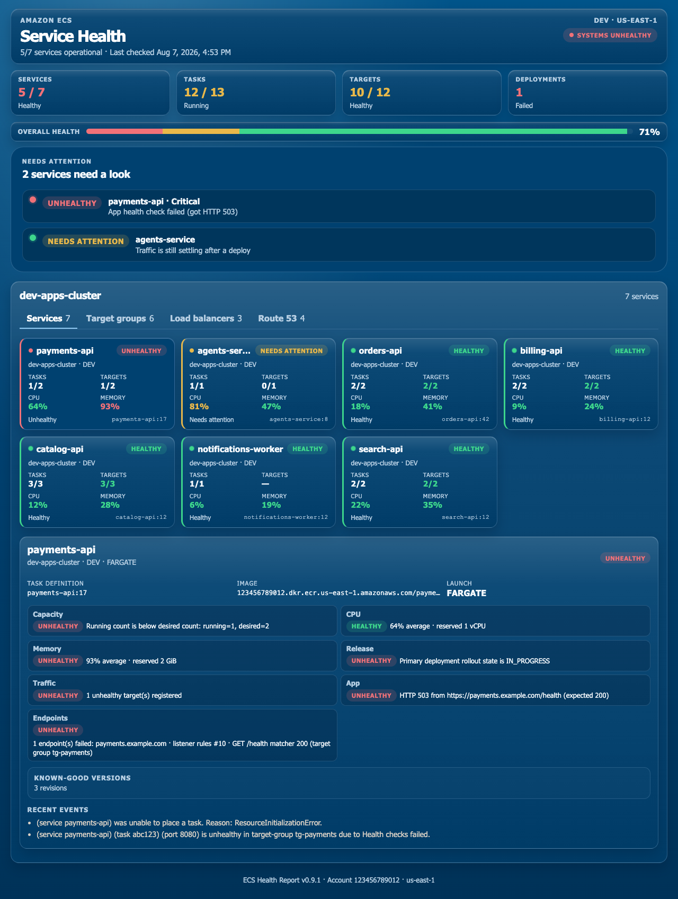

# ecs-service-doctor

**Is your application on ECS actually healthy, or did the control plane just say it is?**

ECS can report a service as stable while your app is still broken: tasks crash-looping after a deploy, load balancer targets failing health checks, the wrong container image running, or the service unable to reach its databases and backends.

This tool checks **applications hosted on AWS ECS** — not just cluster metrics. It validates what matters after every deploy: task counts, **CPU and memory**, rollout state, target group health, **the same HTTP checks your ALB runs**, recent ECS events, **CloudWatch logs**, **task restarts with the exact stop reason**, **inferred backends** (RDS, DynamoDB, Bedrock, ElastiCache, S3, and more), **CI/CD deployment metadata** from GitHub, GitLab, or Bitbucket, container images, and **the last stable task definitions** so you can roll back in one command.

---

## Why ECS applications are hard to observe

Many teams run production apps on ECS because it integrates cleanly with the rest of AWS — AI workloads calling **Amazon Bedrock**, data stored in **RDS** or **DynamoDB**, images pulled from **ECR**, traffic routed through **ALB/NLB** and **Route 53**. ECS handles scheduling without Kubernetes overhead and fits naturally into VPC, IAM, and Secrets Manager.

That stack is powerful, but **application health is harder to see than ECS task health**. A service can show `running=2` while:

- Bedrock or database calls fail because env vars, secrets, or security groups are wrong
- The load balancer routes to tasks that fail HTTP health checks
- A rolling deploy leaves two active revisions with half your traffic on a bad build
- Target groups are misconfigured (wrong container port, no registered targets)
- Tasks are up but CPU or memory is saturating and the app is about to fall over

ecs-service-doctor answers what operators and on-call engineers actually need to know: **can real traffic reach this app, and is the running revision the one we intended to deploy?**

No config file required for a single check.

---

## Features

Everything included today (**v0.11.0**):

### Application health checks

- **Task counts** — running vs desired vs pending; optional expected count per service
- **CPU and memory** — reserved Fargate/EC2 size plus CloudWatch utilization (last 15 min); warns at 80%, fails at 90%
- **Deployment status** — rollout finished, in progress, or failed; flags multiple active revisions during deploys
- **HTTP endpoint check** — probes the same path and success codes as the ALB target-group health check (override with config or CLI)
- **Endpoints** — host-header routes and matching Route 53 names probed with that target-group path/matcher
- **Recent ECS events** — placement failures, health check failures, steady state, and more
- **Task restarts** — stopped tasks in the last 12 hours with the **exact `stoppedReason`**, container exit code, and container reason
- **CloudWatch logs** — recent `awslogs` lines from each service's log group
- **Container image** — full image URI/tag from the live task definition
- **Launch details** — Fargate/EC2, platform version, reserved CPU/memory, network mode
- **Pass / warn / fail** — per-check and per-service status with plain-language summaries

### HTML Service Health Report

Shareable, self-contained HTML — no external assets, open in any browser offline:

- **Day / Night theme toggle** — midnight navy glass by default; switch to a bright pastel frosted-glass day mode
- **KPI strip and health bar** — services, tasks, targets, deployments at a glance
- **Needs attention** — only the services that are not healthy, with a jump link
- **Cluster tabs** — **Services · Backends · CI/CD · Target groups · Load balancers · Route 53 · Logs**
- **Service tiles** — one row per cluster; status, tasks/targets; **Restarted N×** chip when tasks restarted in the last 12 hours
- **Service detail** — image URI, last PRIMARY deployment time, launch details, capacity, CPU, memory, traffic, app health, endpoints, backends, CI/CD, known-good versions, events
- **Backends tab** — RDS, DynamoDB, Bedrock, ElastiCache, S3, SQS, SNS, OpenSearch, and more — inferred from task-definition env vars, URIs, and ARNs, with AWS resource status when IAM allows
- **CI/CD tab** — GitHub Actions, GitLab CI, Bitbucket Pipelines, CodeBuild, CircleCI, and Jenkins signals from the task definition, with ECS deployment rollout history and pipeline links
- **Logs tab** — CloudWatch lines plus the exact stop reason for each recent restart
- **Target groups tab** — health-check path/matcher, healthy/unhealthy counts per group
- **Load balancers tab** — ALB/NLB details, listeners, SSL policy, host-header rules
- **Route 53 tab** — DNS records pointing at cluster load balancers (CloudFront and CNAME chains included)
- Sample: [`examples/ecs_report.sample.html`](examples/ecs_report.sample.html)

### Continuous monitoring and alerts

- **`--interval 10m`** — re-check on a schedule until stopped (`30s`, `10m`, `1h`)
- **Slack webhook** — `--notify-slack` or `notifications.slack_webhook_url`
- **Microsoft Teams** — `--notify-teams` or `notifications.teams_webhook_url`
- **Generic webhook** — `--notify-webhook` for any JSON endpoint (PagerDuty, custom bots, etc.)
- **SNS** — `--notify-sns` / `notifications.sns_topic_arn` for email, SMS, or Lambda fan-out
- **Alert fingerprinting** — the same failure is not re-notified every interval tick until status changes or clears
- **Notify on FAIL by default**; add `--notify-on-warn` to include warnings

### Load balancers and target groups

- **Target group detection** — finds groups attached to each ECS service
- **Attachment validation** — group exists, is attached to ALB/NLB, ECS container name/port matches task definition
- **Target health** — healthy, unhealthy, and registering counts
- **ALB / NLB details** — DNS, scheme, VPC, AZs, listeners, SSL policy, host-header rules with priority numbers
- **Route 53** — hosted-zone records that alias or CNAME to the ALB/NLB (including `dualstack.` targets)
- **Host-header + Route 53 health** — each hostname belonging to this service is checked using the target-group path and matcher

### Stable tasks and rollback

- **Last 3 stable task definitions** — recent known-good revisions per service (configurable limit)
- **Discovery sources** — completed deployments, steady-state events, cleanly stopped tasks
- **Rollback commands** — copy-paste `aws ecs update-service` per revision
- **Image per revision** — see which ECR tag belonged to each stable build

### Backends auto-detection

Infers databases, queues, and AI services from the running task definition and optionally describes them via read-only AWS APIs:

- **Databases** — RDS, Aurora, DocumentDB, ElastiCache detected from host env vars and `.rds.amazonaws.com` / `.cache.amazonaws.com` endpoints
- **Amazon Bedrock** — `BEDROCK_MODEL_ID`, `anthropic.claude*`, and `bedrock-runtime.*` patterns
- **DynamoDB** — `DYNAMODB_TABLE`, table name env vars, ARNs
- **S3, SQS, SNS** — bucket names, queue URLs, topic ARNs
- **OpenSearch, MSK** — endpoint patterns
- **ARN inference** — secrets `valueFrom` ARNs (DynamoDB, RDS, Bedrock, S3, SQS, SNS)
- **AWS status probes** — RDS instance state, DynamoDB table status, Bedrock model availability, ElastiCache cluster state, S3 bucket reachability, SQS/SNS presence
- Missing IAM is a per-backend warning, not a whole-service failure

### CLI and configuration

- **Zero config** — `--cluster` + `--service` is enough
- **Multiple services** — repeat `--service` or use `--all-services` for an entire cluster
- **Critical services** — mark services as critical; report tracks critical failures separately
- **Account safety** — refuse to run if connected to the wrong AWS account
- **Region and profile** — `--region`, `--profile`, or auto-detected from AWS CLI
- **Parallel checks** — batched and parallel AWS API calls for fast multi-service runs

### Output formats

| Format | Use case |
|--------|----------|
| **Plain CLI** | Default — human-readable HEALTHY / WARNING / UNHEALTHY summary |
| **`--verbose`** | Full technical detail including rollback commands and event lists |
| **`--json`** | Machine-readable report for CI/CD pipelines and automation |
| **`--html`** | Self-contained **ECS Service Health Report** (no external assets) |

### CI/CD and safety

- **Exit codes** — `0` pass, `1` warnings, `2` failures (script-friendly)
- **Read-only IAM** — no writes to ECS, load balancers, or Route 53
- **No agents** — runs from your laptop, CI runner, or CloudShell

---

## Quick start

**1. Install**

```bash
pip install -r requirements.txt
```

**2. Verify AWS credentials** (same as the AWS CLI):

```bash
aws sts get-caller-identity
```

**3. Check a service**

```bash
python ecs_doctor.py --cluster my-cluster --service my-api
```

That's it.

---

## Common commands

```bash
# One service
python ecs_doctor.py -c my-cluster -s my-api

# Several services
python ecs_doctor.py -c my-cluster -s api -s worker -s scheduler

# Every service in a cluster
python ecs_doctor.py -c my-cluster --all-services

# Save checks in a config file (optional)
python ecs_doctor.py --config config.json

# CI/CD — exit code 0 = healthy, 1 = warnings, 2 = failures
python ecs_doctor.py -c my-cluster -s my-api --json

# HTML report — shareable page grouped by cluster
python ecs_doctor.py -c my-cluster --all-services --html

# Continuous monitor every 10 minutes + Slack when health checks fail
python ecs_doctor.py --config config.json --interval 10m \
  --notify-slack https://hooks.slack.com/services/XXX/YYY/ZZZ

# Continuous monitor + Teams
python ecs_doctor.py --config config.json --interval 10m \
  --notify-teams https://outlook.office.com/webhook/XXX

# Explicit health URL
python ecs_doctor.py -c my-cluster -s my-api \
  --health-url https://api.example.com/health \
  --interval 10m --notify-webhook https://example.com/hooks/ecs
```

**Optional flags**

| Flag | Purpose |
|------|---------|
| `--region us-east-1` | AWS region (auto-detected if omitted) |
| `--profile my-profile` | AWS CLI profile |
| `--account 123456789012` | Refuse to run in the wrong account |
| `--verbose` | Detailed technical output |
| `--html [FILE]` | Write HTML report (default: `ecs_report.html`) |
| `--json` | Machine-readable output for pipelines |
| `--interval 10m` | Continuous checks (`30s`, `10m`, `1h`) |
| `--health-url URL` | HTTP check URL (overrides auto-detect) |
| `--health-path /health` | Override path; otherwise uses the target-group `HealthCheckPath` |
| `--expected-http-status 200` | Override matcher; otherwise uses target-group success codes |
| `--notify-slack WEBHOOK` | Slack alert on FAIL |
| `--notify-teams WEBHOOK` | Microsoft Teams alert on FAIL |
| `--notify-webhook URL` | Generic JSON webhook on FAIL |
| `--notify-sns TOPIC_ARN` | SNS publish on FAIL |
| `--notify-on-warn` | Also notify on WARN |

---

## Continuous monitoring and HTTP health alerts

Run a check every 10 minutes and notify when a service is unhealthy or its health endpoint fails:

```bash
python ecs_doctor.py --config config.json --interval 10m \
  --notify-slack https://hooks.slack.com/services/XXX/YYY/ZZZ
```

How the HTTP check resolves a URL and matcher:

1. Per-service `health_check_url` / `health_check_path` / `expected_http_status` in config
2. CLI `--health-url` / `--health-path` / `--expected-http-status`
3. ALB target-group `HealthCheckPath`, `HealthCheckProtocol`, `Matcher.HttpCode`, and timeout
4. Fallback: `/health` and status `200`

TCP-only target groups are skipped. Wildcard host headers are listed but not probed. Route 53 names are included when they match this service's host-header rules.

Example config:

```json
{
  "cluster": "dev-apps-cluster",
  "services": [
    {
      "name": "orders-api",
      "health_check_url": "https://api.example.com/health"
    }
  ],
  "checks": {
    "include_http_health": true,
    "http_expected_status": 200
  },
  "notifications": {
    "on_fail": true,
    "slack_webhook_url": "https://hooks.slack.com/services/XXX/YYY/ZZZ",
    "teams_webhook_url": "https://outlook.office.com/webhook/XXX"
  }
}
```

Alerts include the cluster/service, HTTP status and URL when available, and a short issue summary. In continuous mode, the same unhealthy fingerprint is not re-sent every tick until status changes.

---

## What it checks

| Area | What you learn |
|------|----------------|
| **Tasks** | Running vs desired — is the app scaled correctly? |
| **CPU / Memory** | Reserved task size and last-15-min CloudWatch utilization; warn at 80%, fail at 90% |
| **Deployments** | Rollout finished or stuck; multiple active revisions flagged |
| **Load balancers** | Target groups detected, attached to ALB/NLB, container port matches task definition |
| **Route 53** | Hosted-zone records pointing at the service ALB/NLB |
| **Target health** | Healthy vs unhealthy registered targets |
| **Container image** | Which image/tag is actually deployed |
| **Recent events** | Latest ECS error messages (placement failures, health check failures, etc.) |
| **Restarts** | Stopped tasks in the last 12 hours — count, `stoppedReason`, container reason, exit code |
| **Logs** | Recent CloudWatch `awslogs` lines |
| **Backends** | RDS, DynamoDB, Bedrock, ElastiCache, S3, SQS, SNS, OpenSearch and more — inferred from env vars and ARNs, with AWS status when IAM allows |
| **CI/CD** | GitHub Actions / GitLab CI / Bitbucket Pipelines / CodeBuild metadata from the task definition, plus ECS deployment rollout history and pipeline links |
| **Stable tasks** | Last 3 known-good task definitions with image tag and a copy-paste rollback command |
| **HTTP** | App URL checked against target-group path and success codes |
| **Endpoints** | Host-header rules and matching Route 53 names — separate HTTP check per hostname |
| **Connectivity** | Path summary: Route 53 → ALB/NLB → target group → ECS → inferred backends → ECR |

All checks are **read-only** — the tool inspects and reports; it never writes to your AWS resources.

---

## Stable tasks and rollback

When a deploy goes wrong you need the **previous task definition revision** fast. ecs-service-doctor lists the **last 3 stable task definitions** per service, each with:

| Field | Description |
|-------|-------------|
| **Task definition** | Short form e.g. `orders-api:41` |
| **Image** | Container image/tag from that revision |
| **Last stable at** | When it last reached a stable state |
| **Source** | Discovered from a deployment, steady-state event, or stopped task |
| **Current** | Whether this is the revision running now |
| **Rollback command** | Ready-to-run `aws ecs update-service` command |

### How stable tasks are found

Three read-only sources, deduplicated and sorted by most recently stable:

1. **Completed deployments** — ECS deployment records with `rolloutState: COMPLETED`
2. **Steady-state events** — `(service X) has reached a steady state` correlated with task revisions
3. **Cleanly stopped tasks** — stopped by `ServiceSchedulerInitiated` or `UserInitiated`, not crash loops

### Example CLI output

```
[HEALTHY] dev-apps-cluster / orders-api
  Tasks: 2/2 running
  Deployment: finished
  Load balancer: Target groups attached correctly: healthy=2, unhealthy=0
  CPU: 18% average · reserved 0.5 vCPU
  Memory: 41% average · reserved 1 GiB
  Stable task: orders-api:42 (current) — 123456789012.dkr.ecr.us-east-1.amazonaws.com/orders-api:v1.2.3
  Stable task: orders-api:41 — 123456789012.dkr.ecr.us-east-1.amazonaws.com/orders-api:v1.2.2
  Stable task: orders-api:40 — 123456789012.dkr.ecr.us-east-1.amazonaws.com/orders-api:v1.2.1
```

### Roll back in one command

```bash
aws ecs update-service \
  --cluster dev-apps-cluster \
  --service orders-api \
  --task-definition orders-api:41 \
  --force-new-deployment
```

This does **not** roll back automatically — it surfaces candidates and you decide.

### Config (optional)

```json
{
  "checks": {
    "include_stable_task_history": true,
    "stable_task_limit": 3
  }
}
```

---

## CPU and memory

Each service reports **reserved** CPU/memory from the task definition and **utilization** from CloudWatch (`AWS/ECS`, last 15 minutes).

| Signal | Default |
|--------|---------|
| Warn | ≥ 80% |
| Fail | ≥ 90% |

If CloudWatch has no datapoints yet, reserved size still shows and the service is not failed for missing metrics.

```json
{
  "checks": {
    "include_cpu_memory": true,
    "cpu_warn_percent": 80,
    "cpu_fail_percent": 90,
    "memory_warn_percent": 80,
    "memory_fail_percent": 90
  }
}
```

---

## Logs and restarts

The HTML report **Logs** tab shows recent CloudWatch log lines from each service's `awslogs` group. When tasks restarted in the lookback window, it also shows the **exact ECS stop reason** (`stoppedReason`, container reason, exit code).

Service tiles show a **Restarted N×** chip. Hover for the latest reason; open the Logs tab for every stop event.

```json
{
  "checks": {
    "include_logs": true,
    "log_lookback_minutes": 30,
    "log_line_limit": 40,
    "include_restarts": true,
    "restart_lookback_hours": 12
  }
}
```

Set `include_logs` or `include_restarts` to `false` to skip. Restarts do not affect the overall service health score.

---

## Backends (databases, Bedrock, queues)

The **Backends** tab lists data stores and AWS APIs inferred from the running task definition:

- Environment values such as `DB_HOST`, `DATABASE_URL`, `REDIS_URL`, `DYNAMODB_TABLE`, `BEDROCK_MODEL_ID`, `S3_BUCKET`, queue URLs
- Hostnames like `*.rds.amazonaws.com`, `*.cache.amazonaws.com`, `bedrock-runtime.*`
- ARNs from env vars or `secrets.valueFrom` (DynamoDB tables, RDS, S3, SQS, SNS, Bedrock models)

When an identifier can be parsed the tool **describes** the resource via a read-only AWS API: RDS/Aurora instance status, DynamoDB table status, Bedrock model availability, ElastiCache, S3 `HeadBucket`, SQS, SNS, OpenSearch, DocumentDB. It does **not** invoke Bedrock models or open TCP connections into your VPC. Missing IAM is a per-backend warning, not a service failure.

```json
{
  "checks": {
    "include_backends": true
  }
}
```

---

## CI/CD deployments (GitHub, GitLab, Bitbucket)

The HTML report **CI/CD** tab tracks what shipped each service and how the ECS rollout is going.

**Detected from the running task definition** (bake these into your image or task env at build time):

| Provider | Signals |
|----------|---------|
| **GitHub Actions** | `GITHUB_ACTIONS`, `GITHUB_REPOSITORY`, `GITHUB_SHA`, `GITHUB_REF_NAME`, `GITHUB_RUN_ID`, `GITHUB_RUN_NUMBER` |
| **GitLab CI** | `GITLAB_CI`, `CI_PROJECT_PATH`, `CI_COMMIT_SHA`, `CI_COMMIT_REF_NAME`, `CI_PIPELINE_ID`, `CI_PIPELINE_URL` |
| **Bitbucket Pipelines** | `BITBUCKET_REPO_FULL_NAME`, `BITBUCKET_COMMIT`, `BITBUCKET_BRANCH`, `BITBUCKET_BUILD_NUMBER`, `BITBUCKET_PIPELINE_UUID` |
| **AWS CodeBuild** | `CODEBUILD_BUILD_ID`, `CODEBUILD_SOURCE_REPO_URL`, `CODEBUILD_RESOLVED_SOURCE_VERSION` |
| **CircleCI / Jenkins** | `CIRCLE_BUILD_URL`, `BUILD_URL`, `GIT_COMMIT`, `GIT_BRANCH` |

Also reads OCI labels such as `org.opencontainers.image.source` / `revision`, and git-SHA image tags.

For each service the tab shows:

- Provider, repository, branch, commit, build/pipeline number
- Link to the pipeline run when a URL can be built
- ECS deployment history (PRIMARY / ACTIVE, rollout state, task definition, task counts)

**Optional live status** (read-only HTTP APIs — never required):

| Token | Used for |
|-------|----------|
| `GITHUB_TOKEN` / `GH_TOKEN` or config `checks.github_token` | GitHub Actions run / commit status |
| `GITLAB_TOKEN` or `checks.gitlab_token` | GitLab pipeline status |
| `BITBUCKET_USERNAME` + `BITBUCKET_TOKEN` (or app password) | Bitbucket pipeline status |

```json
{
  "checks": {
    "include_cicd": true,
    "github_token": null,
    "gitlab_token": null,
    "bitbucket_username": null,
    "bitbucket_token": null
  }
}
```

Missing tokens only skip the live probe — CI metadata from the task definition still appears.

---

## Config file (optional)

**Minimal config:**

```json
{
  "cluster": "dev-apps-cluster",
  "services": ["orders-api", "payments-api"],
  "region": "us-east-1",
  "expected_account_id": "123456789012"
}
```

`region` and `expected_account_id` are optional. Set `expected_account_id` when you want a safety guard — the tool refuses to run if you are accidentally pointed at the wrong account.

```bash
# Or pass account on the CLI without a config file
python ecs_doctor.py -c my-cluster -s my-api --account 123456789012
```

**Advanced config** — multiple clusters, expected task counts, per-service health URLs:

See [`examples/config.advanced.json`](examples/config.advanced.json).

---

## Sample output

```
ECS Service Check
==================================================
Region: us-east-1
Account: 123456789012

[HEALTHY] dev-apps-cluster / orders-api
  Tasks: 2/2 running
  Deployment: finished
  Load balancer: Target groups attached correctly: healthy=2, unhealthy=0
  Target groups: 1 target group(s): tg-orders — attachments look correct
  CPU: 18% average · reserved 0.5 vCPU
  Memory: 41% average · reserved 1 GiB
  Stable task: orders-api:42 (current) — 123456789012.dkr.ecr.us-east-1.amazonaws.com/orders-api:v1.2.3
  Stable task: orders-api:41 — 123456789012.dkr.ecr.us-east-1.amazonaws.com/orders-api:v1.2.2
  Image: 123456789012.dkr.ecr.us-east-1.amazonaws.com/orders-api:v1.2.3
  Connectivity: Route 53 → Load Balancer → Target Group → ECS → backend(s) → ECR

[UNHEALTHY] dev-apps-cluster / payments-api
  Tasks: 1/2 running — Running count is below desired count: running=1, desired=2
  Deployment: Primary deployment rollout state is IN_PROGRESS
  Load balancer: 1 unhealthy target(s) registered
  CPU: 64% average · reserved 1 vCPU
  Memory: 93% average · reserved 2 GiB
  Stable task: payments-api:16 — 123456789012.dkr.ecr.us-east-1.amazonaws.com/payments-api:v2.0.0
  Latest event: (service payments-api) has started 1 tasks...

==================================================
Result: 1/2 services healthy — problems found
```

---

## HTML report

Generate a self-contained **ECS Service Health Report** you can open in a browser, attach to a release ticket, or share with your team:

```bash
python ecs_doctor.py -c my-cluster --all-services --html
```

Or specify a path:

```bash
python ecs_doctor.py -c my-cluster -s my-api --html my-report.html
```



The report is built for **leadership scan, then drill-down**:

- KPI strip, overall health bar, and attention list of services that are not healthy
- Per-cluster tabs: **Services · Backends · CI/CD · Target groups · Load balancers · Route 53 · Logs**
- Service tiles in one row with **Restarted N×** chips and status lights
- Service detail: full image URI, last PRIMARY deployment time, launch details, capacity, CPU, memory, traffic, HTTP health, endpoints, backends, CI/CD, known-good versions, events
- Logs tab: CloudWatch lines plus the exact AWS stop reason for each recent restart
- Backends tab: every inferred data store grouped by service, with live AWS status
- CI/CD tab: GitHub / GitLab / Bitbucket / CodeBuild metadata plus ECS rollout history and pipeline links

**Preview:** open [`examples/ecs_report.sample.html`](examples/ecs_report.sample.html) in a browser (sample data, no credentials needed).

To regenerate the sample and screenshot:

```bash
cd report-ui && npm install && npm run build && cd ..
python examples/generate_sample_html.py
```

Requires Playwright for the screenshot step (`cd report-ui && npx playwright install chromium` once).

---

## IAM permissions

Read-only access only:

- `ecs:ListServices`
- `ecs:DescribeServices`
- `ecs:DescribeTaskDefinition`
- `ecs:ListTasks`
- `ecs:DescribeTasks`
- `cloudwatch:GetMetricData`
- `logs:FilterLogEvents`
- `elasticloadbalancing:DescribeLoadBalancers`
- `elasticloadbalancing:DescribeListeners`
- `elasticloadbalancing:DescribeRules`
- `elasticloadbalancing:DescribeTargetGroups`
- `elasticloadbalancing:DescribeTargetHealth`
- `route53:ListHostedZones`
- `route53:ListResourceRecordSets`
- `servicediscovery:GetService`
- `sts:GetCallerIdentity`
- `rds:DescribeDBInstances`
- `rds:DescribeDBClusters`
- `dynamodb:DescribeTable`
- `bedrock:GetFoundationModel`
- `elasticache:DescribeCacheClusters`
- `elasticache:DescribeReplicationGroups`
- `s3:ListBucket` (HeadBucket)
- `sqs:GetQueueUrl`
- `sqs:GetQueueAttributes`
- `sns:GetTopicAttributes`
- `es:DescribeDomain` / `opensearch:DescribeDomain`
- `docdb:DescribeDBClusters`
- `sns:Publish` (only if you use SNS notifications)

---

## Exit codes

| Code | Meaning |
|------|---------|
| 0 | All checks passed |
| 1 | Warnings (non-critical issues) |
| 2 | Failures found |
| 130 | Interrupted |

---

## License

MIT
